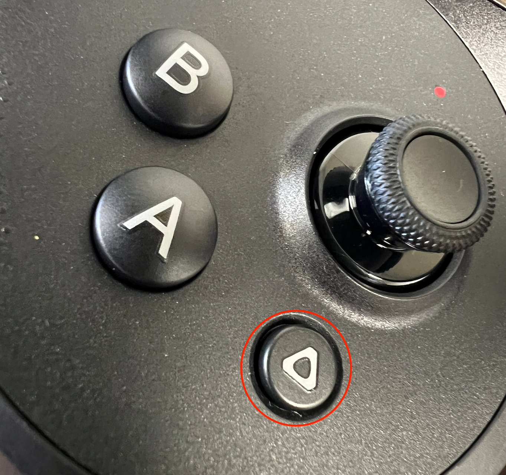
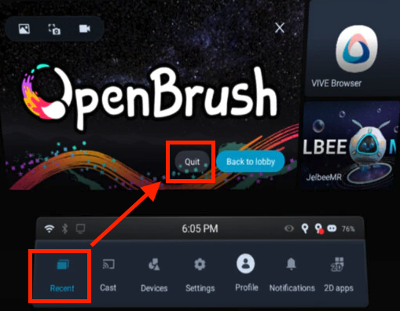
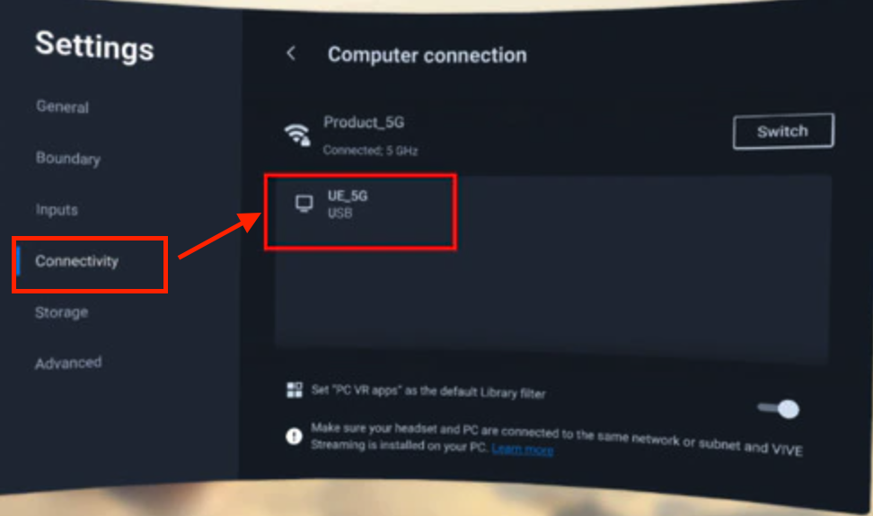

# VRNotes

Notes on how to operate the Vive Focus

## See through

There are 2 ways to toggle see through.
1, Double click the circle button on the right side of the headset (physical button)  


2, Double click on the ```Vive``` button on the right controller:



## Quit An App

Click the ```Vive``` button to pull out the ```Vive Menu```(you can always pull out the vive menu in any situation). then click on the ```Recent``` button in the menu, and then click on the ```Quit``` button to quit the app. You can also click the ```Back to Lobby``` to go back to the lobby.



## Launch the PC Streamed VR app
1, Install ```Vive Hub``` and ```Steam VR``` if not installed on ```Steam```

2, Launch the ```Vive Hub``` and ```SteamVR``` on the PC

3, Connect the head set to the PC with a usb Type-C cable

```NOTE: both end has to be Type-C.```

4, In the head set, go to the lobby, click on ```Settings```, and then ```Connectivity```, and click on the USB connection in the list right under the Wifi settings to establish the connection to the PC.




5, Go to the lobby again, click on ```Library``` and click on the Monior icon on the upper right corner to switch to ```PC VR Apps``` and you should see the ```SteamVR``` app and other VR apps you have on your PC.

6, Launch any app by aiming at them and press the trigger.