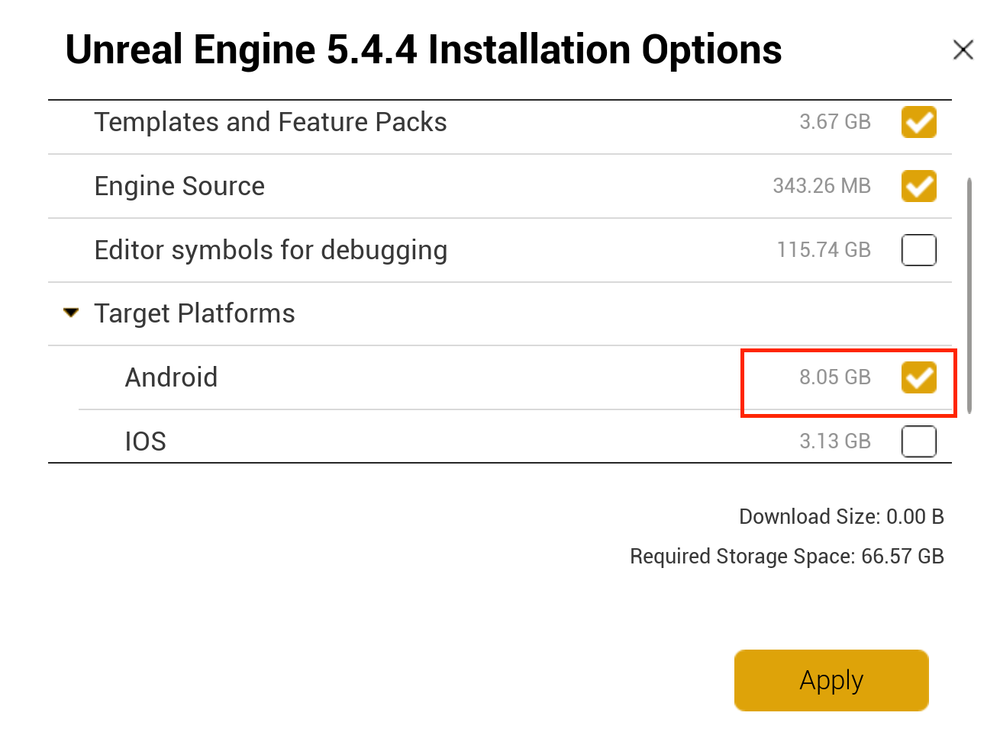
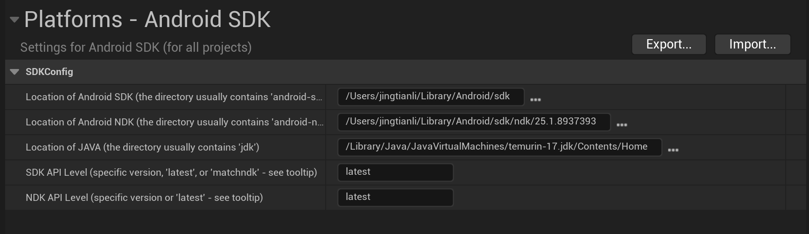

# Unreal VR Setup for Vive Foucs Vision


This is based on the [Vive Official Documentation](https://developer.vive.com/resources/openxr/)

## Prereq:
* Unreal Engine 5.4 
* The Engine is installed with Android Plateform:


* Open a terminal and navigate to the Unreal Engine Installation folder, and got to:
```Engine/Build/BatchFiles```

Follow this [Setting up Android SDK and NDK](https://dev.epicgames.com/documentation/en-us/unreal-engine/set-up-android-sdk-ndk-and-android-studio-using-turnkey-for-unreal-engine?application_version=5.4) to setup up android support, or rollow this [Advanced Android SDK Setup](https://dev.epicgames.com/documentation/en-us/unreal-engine/advanced-setup-and-troubleshooting-guide-for-using-android-sdk?application_version=5.4) to install mannually.

You also need to install JDK:
[JDK Download](https://adoptium.net/temurin/releases/?version=17)

And here is the SDK configuration if it needs mannual setup:
